# Learning notes

## Creating a new plugin

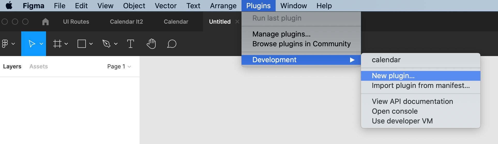
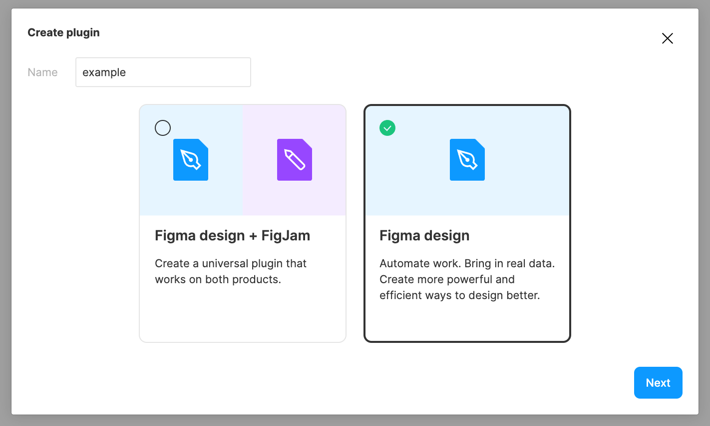
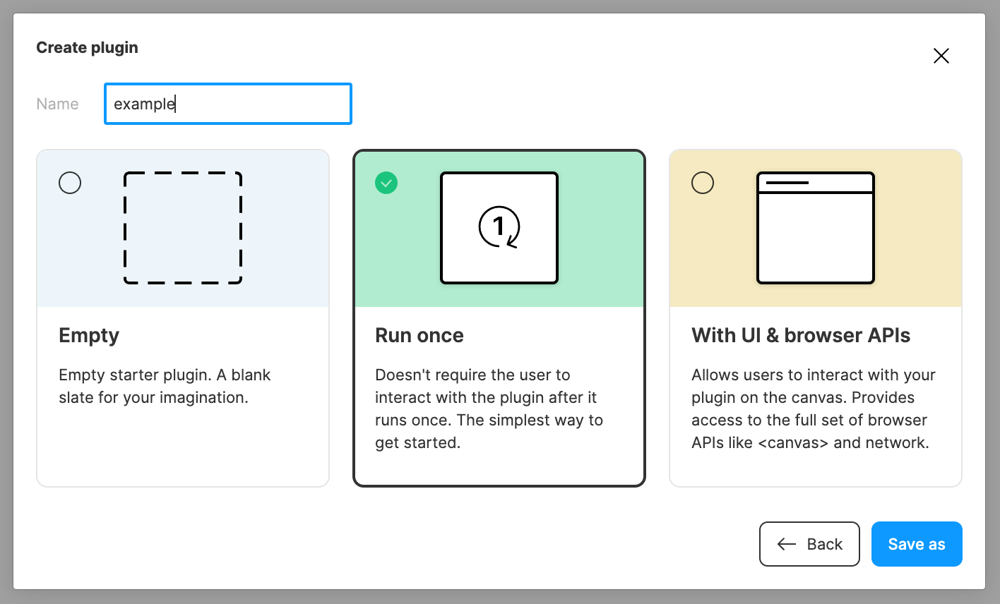
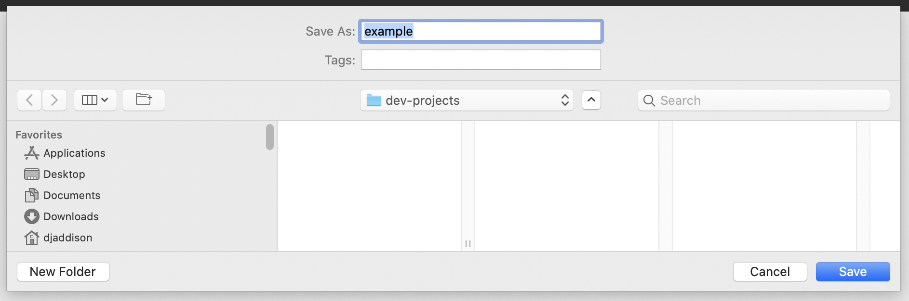
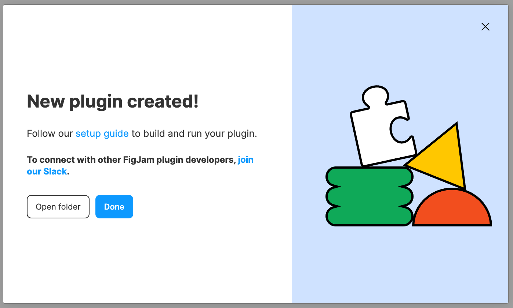
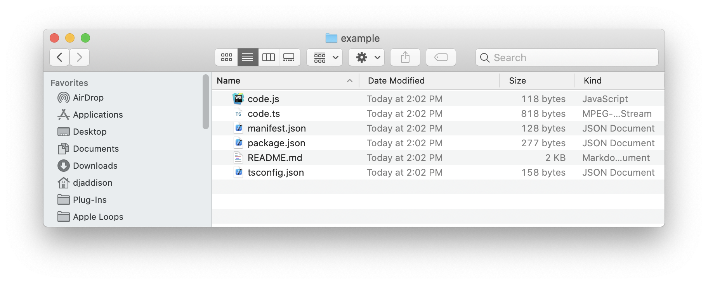

## Environment Assumptions

- node.js is installed
- yarn.js is installed
- Visual Studio Code is installed
- Running in a unix based environment

## Initial Setup

- https://www.figma.com/plugin-docs/setup/

- Remove boilerplate files

  ```bash
  rm README.md code.js
  ```

- Add `start` script to `package.json`

  ```json
  /* package.json */
  "scripts": {
    "start": "tsc -p tsconfig.json --watch",
    "build": "tsc -p tsconfig.json"
  },
  ```

- Install packages

  ```bash
  yarn install
  ```

- Update the project to move main source out of the project root

  ```json
  /* tsconfig.json */
  {
    "compilerOptions": {
      "outDir": "dist/",
      "target": "es6",
      "lib": ["es6"],
      "typeRoots": ["./node_modules/@types", "./node_modules/@figma"]
    },
    "include": ["src/**/*"]
  }
  ```

  ```json
  /* package.json */
  "main": "dist/main.js",
  ```

  ```json
  /* manifest.json */
  {
    "name": "example",
    "id": "1097222528620279676",
    "api": "1.0.0",
    "main": "dist/main.js",
    "editorType": ["figma"]
  }
  ```

  ```bash
  mkdir src
  mv code.ts src/main.ts
  ```

- Build the project to generate `dist/main.js`

  ```bash
  yarn build
  ```

- Run the plugin
  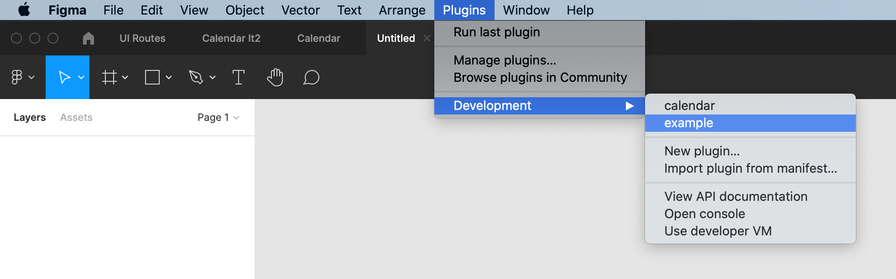

## The basics

- Figma API methods and properties are available via the `figma` global object
- `figma.closePlugin()` - Always call this function once the plugin is done running
- `figma.currentPage` - The current visible page
- `SceneNode` - Node contained within a page (base class)
  - `FrameNode`
  - `GroupNode`
  - `RectangleNode`
  - `TextNode`
- `createRectangle()` - default fill, width and height both at 100, and is parented under figma.currentPage
- `node.name` - the label that appears in the layers panel
- `node.x` - x coordinate
- `node.y` - y coordinate
- `node.width` - read-only property
- `node.height` - read-only property
- `node.resize(width, height)` - call `resize` to set width and height

## Examples

### Example 1: RectangleNode

```typescript
/**
 * Example 1: RectangleNode
 * Demonstrates adding a RectangleNode to the document
 *
 * figma.createRectangle(): RectangleNode
 *
 * returns a RectangleNode with the following properties
 *    fill: default
 *    x: 0
 *    y: 0
 *    name: "Rectangle"
 *    width: 100
 *    height: 100
 *    parent: figma.currentPage
 *
 * Reference:
 *    https://www.figma.com/plugin-docs/api/properties/figma-createrectangle/
 *    https://www.figma.com/plugin-docs/api/properties/figma-closeplugin/
 *    https://www.figma.com/plugin-docs/api/RectangleNode/
 */

figma.createRectangle()
figma.closePlugin()
```

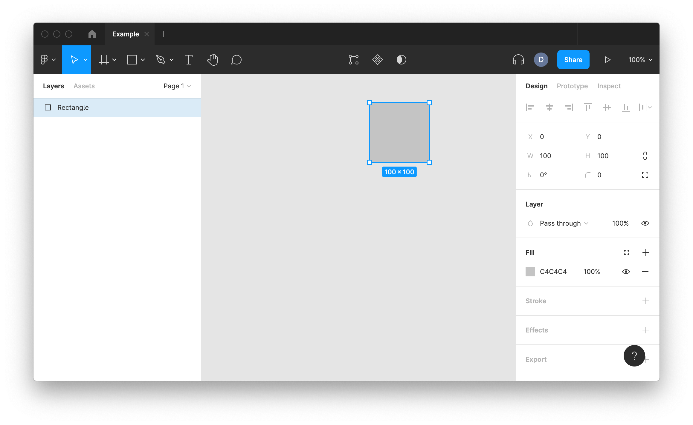

### Example 2: FrameNode with child

```typescript
/**
 * Example 2: FrameNode with child
 * Demonstrates creating a FrameNode and RectangleNode
 * Make the RectangleNode a child of the FrameNode
 *
 * figma.createFrame(): FrameNode
 *
 * returns a FrameNode with the following properties
 *    fill: white
 *    x: 0
 *    y: 0
 *    name: "Frame"
 *    width: 100
 *    height: 100
 *    parent: figma.currentPage
 *
 * Reference:
 *    https://www.figma.com/plugin-docs/api/properties/figma-createframe/
 *    https://www.figma.com/plugin-docs/api/FrameNode/
 */

const frame = figma.createFrame()
const rectangle = figma.createRectangle()
frame.appendChild(rectangle)
figma.closePlugin()
```

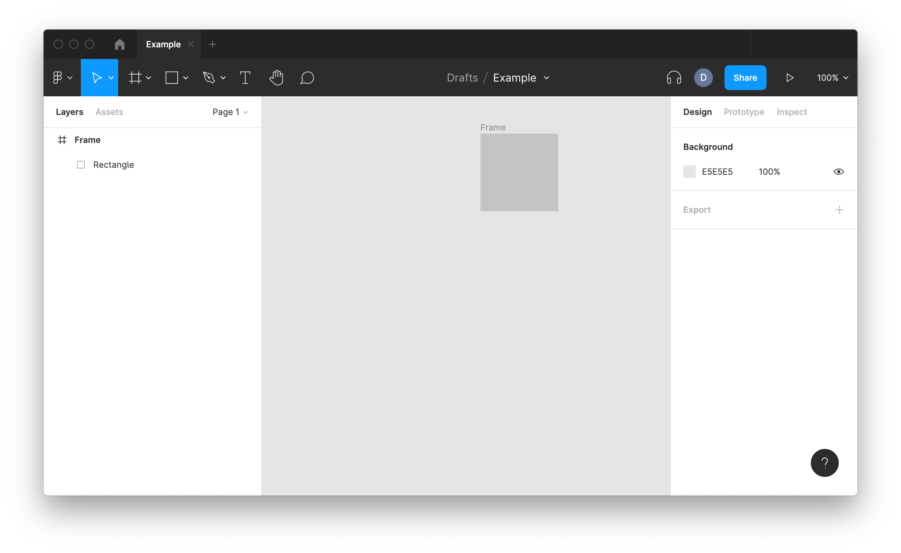

### Example 3: Setting fill color

```typescript
/**
 * Example 3: Setting fill color
 */

const COLOR_BLACK: SolidPaint = { type: "SOLID", color: { r: 0, g: 0, b: 0 } }
const rectangle = figma.createRectangle()
rectangle.fills = [COLOR_BLACK]
figma.closePlugin()
```

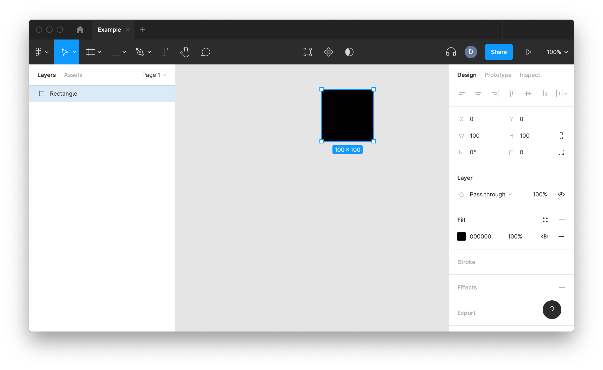

### Example 4: Setting position and size

```typescript
/**
 * Example 4: Setting position and size
 */

const rectangle = figma.createRectangle()
rectangle.x = 5
rectangle.y = 10
rectangle.resize(50, 200) // width, height
figma.closePlugin()
```

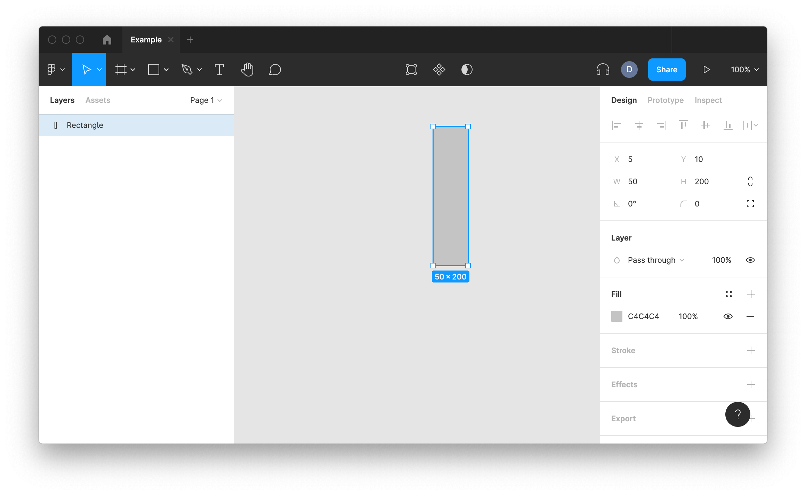

### Example 5: Setting node name

```typescript
/**
 * Example 5: Setting node name
 */

const rectangle = figma.createRectangle()
rectangle.name = "figma-plugin-example"
figma.closePlugin()
```

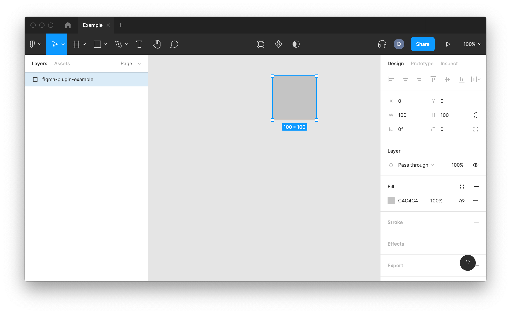

### Example 6: Create six rectangles

```typescript
/**
 * Example 6: Create six rectangles
 */

const NUMBER_OF_RECTANGLES = 6
const SPACE_BETWEEN = 10

for (let i = 0; i < NUMBER_OF_RECTANGLES; i++) {
  const rectangle = figma.createRectangle()
  rectangle.name = `rectangle-${i}`
  rectangle.x = i * (rectangle.width + SPACE_BETWEEN)
}
figma.closePlugin()
```

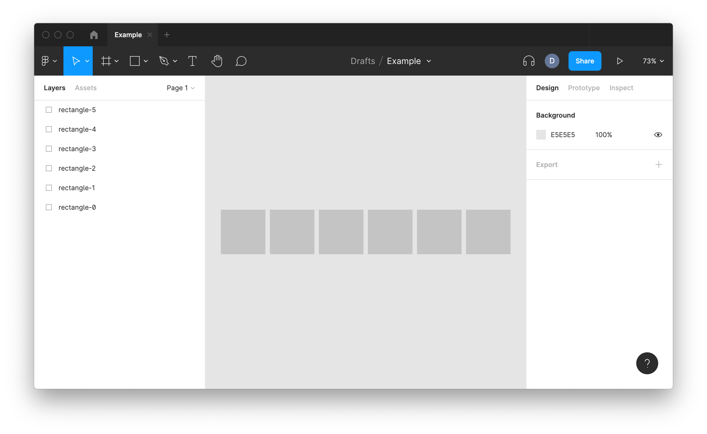

## References

- https://www.figma.com/plugin-docs/intro/
- https://www.figma.com/plugin-docs/api/figma/
- https://www.figma.com/plugin-docs/api/nodes/
- https://www.figma.com/plugin-docs/api/properties/figma-createrectangle/
- https://www.figma.com/plugin-docs/api/properties/figma-createframe/
- https://www.figma.com/plugin-docs/api/properties/figma-closeplugin/
- https://www.figma.com/plugin-docs/api/properties/figma-group/
- https://www.figma.com/plugin-docs/api/FrameNode/
- https://www.figma.com/plugin-docs/api/GroupNode/
- https://www.figma.com/plugin-docs/api/RectangleNode/
- https://www.figma.com/plugin-docs/api/TextNode/
- https://www.figma.com/plugin-docs/working-with-text/
