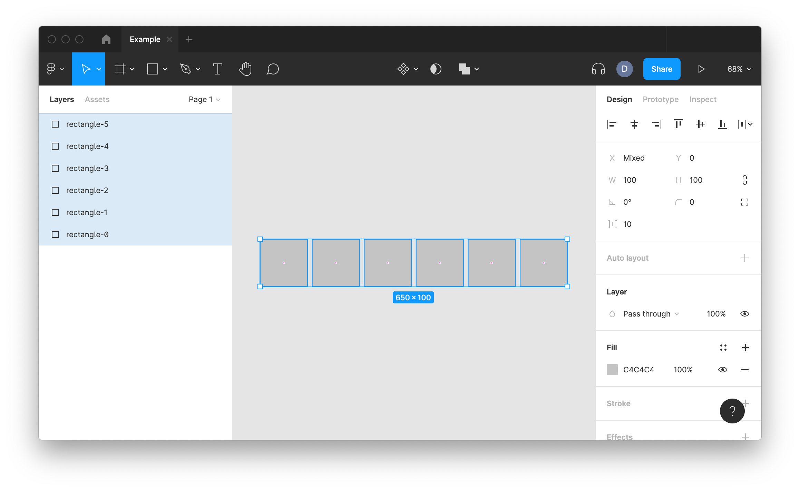

# Learning notes

## Creating a new plugin


## Environment Assumptions

- node.js is installed
- yarn.js is installed
- Visual Studio Code is installed
- Running in a unix based environment

## Initial Setup

- https://www.figma.com/plugin-docs/setup/

- Remove boilerplate files

  ```bash
  rm README.md code.js
  ```

- Add `start` script to `package.json`

  ```json
  /* package.json */
  "scripts": {
    "start": "tsc -p tsconfig.json --watch",
    "build": "tsc -p tsconfig.json"
  },
  ```

- Install packages

  ```bash
  yarn install
  ```

- Update the project to move main source out of the project root

  ```json
  /* tsconfig.json */
  {
    "compilerOptions": {
      "outDir": "dist/",
      "target": "es6",
      "lib": ["es6"],
      "typeRoots": ["./node_modules/@types", "./node_modules/@figma"]
    },
    "include": ["src/**/*"]
  }
  ```

  ```json
  /* package.json */
  "main": "dist/main.js",
  ```

  ```json
  /* manifest.json */
  {
    "name": "example",
    "id": "1097222528620279676",
    "api": "1.0.0",
    "main": "dist/main.js",
    "editorType": ["figma"]
  }
  ```

  ```bash
  mkdir src
  mv code.ts src/main.ts
  ```

- Build the project to generate `dist/main.js`

  ```bash
  yarn build
  ```

- Run the plugin
  

## The basics

- Figma API methods and properties are available via the `figma` global object
- `figma.closePlugin()` - Always call this function once the plugin is done running
- `figma.currentPage` - The current visible page
- `SceneNode` - Node contained within a page (base class)
  - `FrameNode`
  - `GroupNode`
  - `RectangleNode`
  - `TextNode`
- `createRectangle()` - default fill, width and height both at 100, and is parented under figma.currentPage
- `node.name` - the label that appears in the layers panel
- `node.x` - x coordinate
- `node.y` - y coordinate
- `node.width` - read-only property
- `node.height` - read-only property
- `node.resize(width, height)` - call `resize` to set width and height

## Examples

### Example 1: RectangleNode

@import "example-01.ts"


### Example 2: FrameNode with child

@import "example-02.ts"


### Example 3: Setting fill color

@import "example-03.ts"


### Example 4: Setting position and size

@import "example-04.ts"


### Example 5: Setting node name

@import "example-05.ts"


### Example 6: Create six rectangles

@import "example-06.ts"


### Example 7: Selecting nodes and zoom into view

@import "example-07.ts"


## References

- https://www.figma.com/plugin-docs/intro/
- https://www.figma.com/plugin-docs/api/figma/
- https://www.figma.com/plugin-docs/api/nodes/
- https://www.figma.com/plugin-docs/api/properties/figma-createrectangle/
- https://www.figma.com/plugin-docs/api/properties/figma-createframe/
- https://www.figma.com/plugin-docs/api/properties/figma-closeplugin/
- https://www.figma.com/plugin-docs/api/properties/figma-group/
- https://www.figma.com/plugin-docs/api/FrameNode/
- https://www.figma.com/plugin-docs/api/GroupNode/
- https://www.figma.com/plugin-docs/api/RectangleNode/
- https://www.figma.com/plugin-docs/api/TextNode/
- https://www.figma.com/plugin-docs/working-with-text/
- https://www.figma.com/plugin-docs/editing-properties/
- https://www.figma.com/plugin-docs/accessing-document/#getting-the-current-selection
- https://www.figma.com/plugin-docs/api/properties/PageNode-selection/
